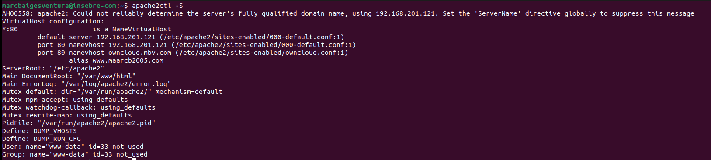

# COMANDA apache2ctl -S

3.3.- Al directori Learn more about owncloud hi ha informació en forma de fitxers pdf. Consulta'ls i respon aquestes preguntes:

Quin són els tres tipus de protecció de dades que ofereix Owncloud?
Bueno tenim 3 tipos de protecció en encriptació en transit, en repos i d'extrem a extrem.

Fes una petita descripció de cada un d'ells.
## EN TRANSIT
Aquest ve per defecte, apart de ser obligatori, garanteix la seguretat de les dades.
## EN REPOS 
Aquest xifra tots els fitxers creats del servidor, aquest xifratge és perfecte per poder evitar problemes de secret de dades.
## D'EXTREM A EXTREM
Aquest es el més segur ja que ni els administradors del sistema poden accedir a la vostra informació, alguna de les desadventatges es que té una carrega molt gran i si es perd la clau no podrem desxifraru de cap manera.

Per quina raó ens recomana utilitzar Owncloud per als documents de Microsoft Office de la nostra empresa?
*És fàcil d'utilitzar i eficient.*
*És molt segur i grantitza privacitat.*
*Ofereix opcions de desplegament.*
*És de codi obert.*
*S'adapta als diferents casos d'us*

**Això passa a tots els països?**

**Quina és la llicència d'OWncloud Enterprise?**

**I la d'Owncloud Standard?**

**Es poden veure videos en Streaming directament des de Owncloud?**

**Es poden connectar directoris de Google Drive a Owncloud?**
  
  Si és podem sincronitzar les nostres carpetes del Drive al Owncloud

**I Dropbox?**

**Compta Owncloud amb antivirus? En cas afirmatiu com es diu?**
