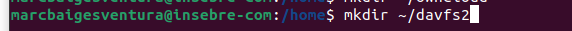

*INSTAL·LACIÓ WebDAV* 

Jo ho he fet amb comanandes de LINUX.

Primer intsal·lare el controlador del sistema. 

sudo apt-get install davfs2

sudo yum install davfs2

L'agregarem al grup 

Despres crearem dos carpetes una per al owncloud al directori home i un altra per al controlador davfs2

