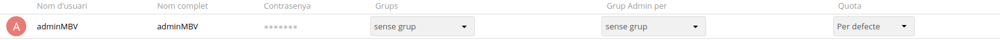
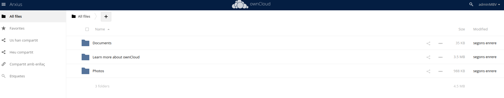
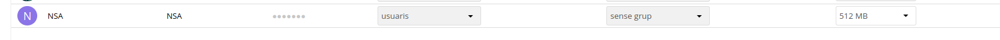

**ACTIVITAT 4**

4.1.- Crea un usuari admin que es digui adminXYZ, on XYZ són les inicials del teu nom:

4.2.- Inicia sessió com a l'usuari adminXYZ.

4.3.- Crea un usuari XYZ on XYZ son les inicials del company/a i afegeix-lo al grup usuaris, aquest usuari tindrà una quota de 512 MB.

