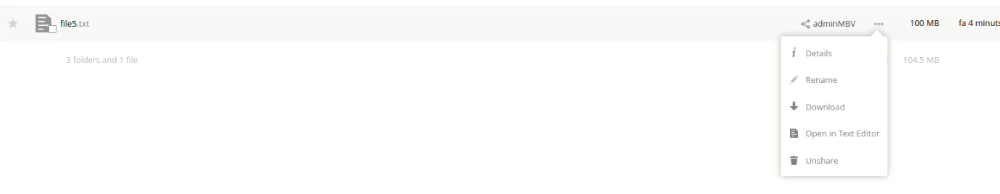

**ACTIVITAT 4**

4.1.- Crea un usuari admin que es digui adminXYZ, on XYZ són les inicials del teu nom:

4.2.- Inicia sessió com a l'usuari adminXYZ.

4.3.- Crea un usuari XYZ on XYZ son les inicials del company/a i afegeix-lo al grup usuaris, aquest usuari tindrà una quota de 512 MB.

Crea 6 fitxers de 100MB i pujal's a Owncloud un per un.

4.5.- Mostra el missatge d'error per haver superat la quota d'usuari.

4.6.- Busca al teu perfil quin percentatge de quota estas utilitzant.

4.7.- Canvia la quota de l'usuari a 1GB i mostra tots els fitxers pujats.

4.8.- Crea un usuari anomenat usuari2XYZ i fical al grup usuaris.

4.9.- Comparteix un fitxer de usuariXYZ a usuari2XYZ i mostra com l'usuari2XYZ pot veure i descarregar el fitxer.

Com poddem veure a la dreta ens surt l'arxiu compartit i qui ens la compartit.

4.9.- Comparteix un fitxer de usuariXYZ a usuari2XYZ i mostra com l'usuari2XYZ pot veure i descarregar el fitxer.

4.10.- Esborra la carpeta Learn more about owncloud.

4.11.- Recupera la carpeta Learn more about owncloud.

Caldra anar a l'apartat de fitxers esborrats i podrem posar recuperar i el tornarem a tindre.

4.12.- Com a usuariXYZ crea una carpeta nova anomenada shared i comparteix-la amb l'usuari usuari2XYZ.

